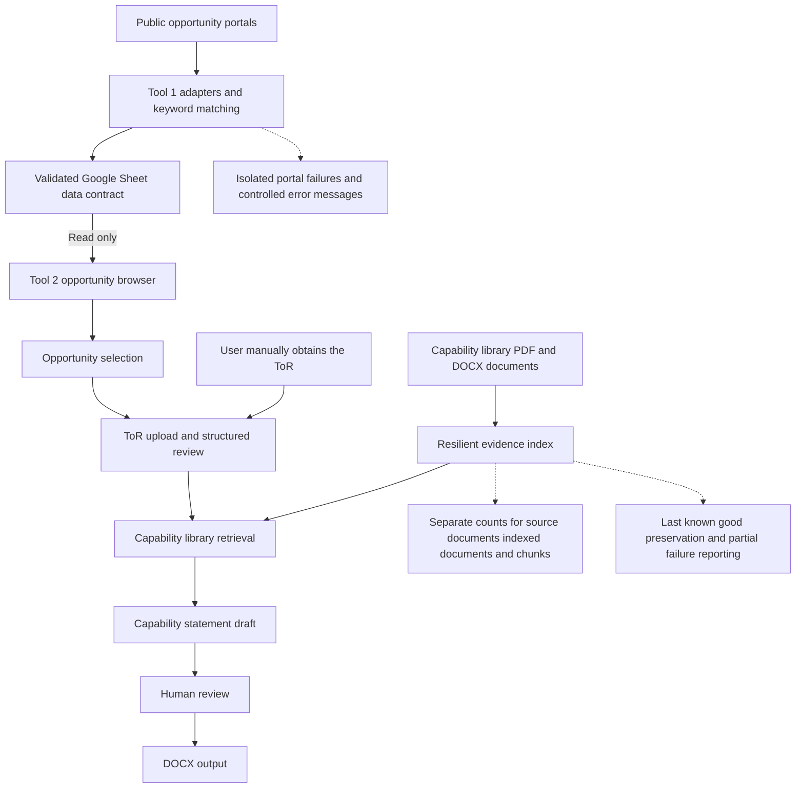

# Architecture

## Opportunity Intelligence and Evidence-Assisted Proposal Platform

Tool 1 collects and qualifies opportunities. Tool 2 uses that shortlist to help a person prepare a capability statement. A validated Google Sheet carries the shared records; a separate evidence index supplies capability passages. Human judgment remains part of the workflow.

## How to read the diagram

Follow the main path from portals to the final document. Tool 1 finds records and explains keyword matches. The Sheet supplies a common structure that both tools validate. Tool 2 reads those records, lets a person choose one, and accepts a separately obtained ToR.

The capability library follows a second path into the evidence index. Retrieval selects passages relevant to the reviewed requirements. Drafting uses those passages as context, and the user edits and checks the result before exporting it. Dotted connections describe reliability controls, not additional automatic business steps.

## Responsibilities and boundaries

| Component | Responsibility | Important boundary |
|---|---|---|
| Python adapters and orchestrator | Collect, match, deduplicate and stamp discovery time | A failed portal does not prove an empty market |
| Google Sheet contract | Carry validated shared records | Header validation is not a security certification |
| Streamlit opportunity browser | Read, search, filter, sort, page and select | No Sheet writes from this browser |
| ToR extraction and review | Structure uploaded requirements and present source context | Model extraction requires human checking |
| Chroma evidence index | Store searchable document passages | Preserved evidence can be stale |
| Retrieval and draft generation | Supply relevant passages and produce a reviewable draft | A source reference does not prove a statement is supported |
| Review and DOCX export | Let a person inspect and edit the deliverable | Human review remains necessary |

## Reliability choices

Header-name-driven access protects against reordered Sheet columns; missing or duplicate required headers are rejected. Discovery timestamps remain separate from deadlines. UNDP detail enrichment uses full text for matching when available while keeping display text manageable.

Index updates prepare replacement generations before deleting older evidence and report partial recovery failures. Source documents, successfully indexed documents and searchable chunks have separate counts. Controlled failure reasons avoid displaying raw exception content, but public recordings still require synthetic filenames.

## Completed versus planned

The diagram describes the delivered workflow, not a live-service availability guarantee. ToR downloading remains manual, and an in-app Tool 1 trigger is not part of the completed scope.

Deterministic evidence-quote verification and a generic Evidence Studio product are planned next-stage work. Complete retrieval/evidence integrity, fully verified citations and guaranteed accuracy are not claimed.
